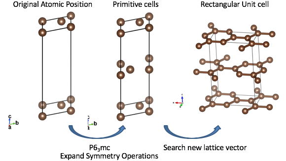

# salmon_inp

A Converter from CIF to SALMON input file.




[SALMON](#SALMON) is an open-source software based on first-principles time-dependent density functional theory to describe optical responses and electron dynamics in matters induced by light electromagnetic fields.
This program generates the input file format of the SALMON from the CIF-formatted crystal structure data.
The CIF is the most popular file format for the data archive of the crystallographic information.
The CIF formatted data can be obtained from many  [distribution websites](#CIF Archives).

This program has functionalities as below:
- Generate the atomic coordinates from the CIF by considering the symmetric operations, and construct the rectangular supercell which can be treated in the SALMON.
- Estimate the preferred grid spacing from the contained atomic species.
- Automatic downloads of pseudopotential files required in the calculation (optional).

It is convenient for preparation of your input files.


## Requirements

 - Python 3
 - NumPy 1.10 or later
 - SciPy

## Usage

### Simple usage

 ```
 ./cif2salmon.py < CIFFILE.cif > inputfile.inp
 ```

The translated input file is exported on the `stdout`.

### Automatic Download of Pseudopotential Files

Use `-d` or `--download` options to get the pseudopotential files used in the input file.
```
./cif2salmon.py -d < CIFFILE.cif > inputfile.inp 
```


### Write out the Generated Supercell

Use `--export-cif` options to export the CIF file of the generated supercell structure.
```
./cif2salmon.py --export-cif=OUTPUT.cif < CIFFILE.cif 
```
You can check the generated structure by using the CIF supported viewers.

### NOTE
- This program automatically estimates the spatial division (`nrgrid`) from the atomic species.
However, it is often insufficient for the material systems including d-orbits such as the transition metals.
We strongly recommend ** the trial-and-error testing to check the convergence ** by your self.
- The real-time (`dt`) and k-space sampling grid (`nkgrid`)  is presently not automatically estimated, and it is necessary to set the adequate values by your self.

## External Links

### SALMON Project
  - SALMON Official Website - https://salmon-tddft.jp/
  - SALMON Github Repository - https://github.com/salmon-tddft/SALMON/


### CIF Archives
  - Atom Work - http://crystdb.nims.go.jp/ 
  - Cambridge Crystallographic Data Centre (CCDC) - http://www.ccdc.cam.ac.uk -
  - inorganic crystal structures database (ICSD) - http://icsd.fiz-karlsruhe.de/
  - Crystallography Open Database (COD) - http://www.crystallography.net/

  
### CIF Format
  - Hall SR, Allen FH, Brown ID (1991). "The Crystallographic Information File (CIF): a new standard archive file for crystallography." Acta Crystallographica. A47 (6): 655–685. doi:10.1107/S010876739101067X
  
  
  
