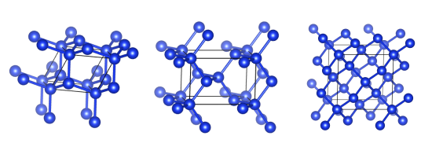

# salmon_inp



Convert CIF to SALMON inputfile

## Requirements

 - Python 3
 - NumPy 1.10 or later
 - SciPy

 ## Usage

 ```
 ./cif2salmon.py < CIFFILE.cif > inputfile.inp
 ```

The translated inputfile is exported on the `stdout`.
